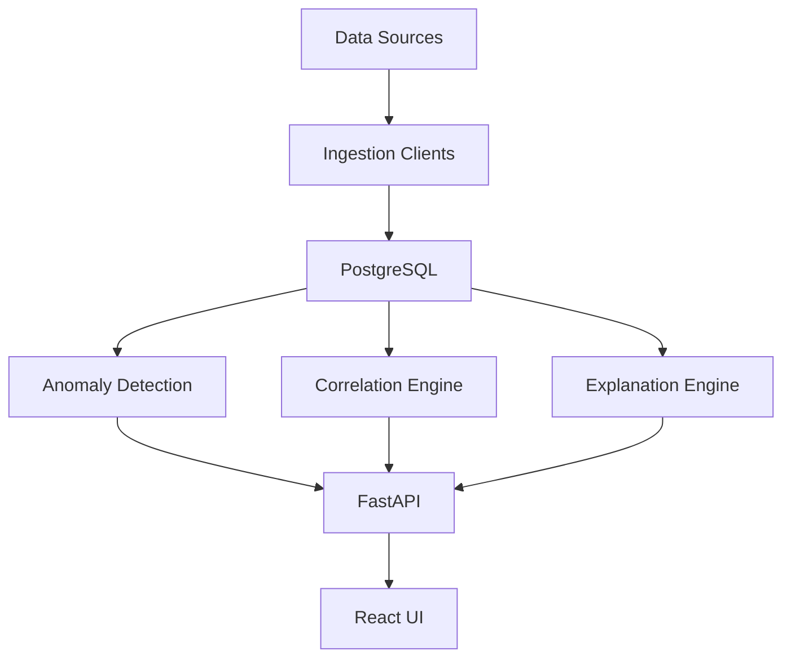

# MacroLens

MacroLens is an AI-powered economic event explorer.

It ingests economic and market datasets, detects unusual events in those datasets, finds related movements in other series, and presents an explanation workflow through a web UI.

The core idea is simple:

most charting tools show you that something moved.
MacroLens tries to help you investigate why it might have moved.

## System Pipeline



## Project Motivation

MacroLens was built as a systems project around a question most charting tools do not try to answer: not just what moved in economic data, but what evidence might help explain why it moved.

The project also intentionally explores a modern development workflow that combines traditional engineering with AI-assisted coding. The goal is not to treat AI as a code generator, but to use it inside a disciplined engineering process that still includes system design, explicit data pipelines, reproducible experiments, architectural decision records, structured debugging, and documentation.

The repository therefore emphasizes not only the final implementation, but also the reasoning process behind it. Development logs, experiment records, decision records, and bug investigations are part of the project by design.

## What MacroLens Does

For each supported dataset, MacroLens can:

- ingest historical data from external sources
- normalize and store it in PostgreSQL
- detect anomalies with rolling z-score and change-point logic
- group nearby anomalies into persisted macro-event clusters with explicit episode-quality labels
- compute lag-aware correlations against other datasets
- retrieve article context around anomaly windows
- generate explanation text from stored evidence
- trace suggested downstream propagation paths from one macro-event cluster to later clusters
- aggregate repeated leading relationships into a dataset-level leading-signal view
- expose all of that through an API and frontend investigation interface

## What Makes This Project Interesting

This is not just a chart viewer.

The system is built as an evidence pipeline:

1. raw data is fetched from source APIs
2. normalized data is stored in PostgreSQL
3. anomalies are persisted as first-class events
4. nearby anomalies are grouped into persisted macro-event clusters
5. downstream propagation links are derived from persisted lagged relationships and later anomaly matches
6. correlations are persisted as supporting evidence
7. article context is persisted as cited event evidence
8. explanations are generated from stored system state
9. the frontend lets a user inspect the result

That makes the repo more than a frontend demo. The backend reasoning chain is the actual product.

## Current Project Status

MacroLens currently has a working end-to-end MVP slice.

### Implemented

- FastAPI backend
- PostgreSQL schema
- CoinGecko ingestion for Bitcoin
- FRED ingestion for CPI, Federal Funds Rate, WTI oil, S&P 500, and household macro series
- rolling z-score anomaly detection
- `ruptures`-based change-point detection for structural shifts
- per-dataset detector overrides for sparse monthly series and conservative structural detectors
- lag-aware correlation discovery on percent changes
- persisted anomaly clustering into macro-event groups
- frequency-aware episode clustering with persisted quality metadata
- cluster-to-cluster propagation timeline generation
- episode-quality-aware propagation scoring
- dataset-level leading-indicator discovery built on clustered event episodes
- stored news-context retrieval through GDELT
- explanation generation through a provider abstraction
- React frontend connected to the live API

### Current explanation model

The current default explanation provider is `rules_based`.

MacroLens now also includes `openai` and `gemini` provider paths behind the same provider abstraction.

That means:

- the default local workflow remains deterministic and cheap
- a live hosted model can be enabled through environment variables
- the system keeps the rules-based provider as fallback

The hosted-provider paths are implemented and have been validated on live anomalies, but they should still be treated as staged integrations rather than production-ready defaults. Prompt quality, comparative evaluation, and failure-handling polish are still part of the next phase.

### Current news context model

MacroLens now uses a hybrid contextual-evidence approach.

That layer:

- retrieves live article citations around an anomaly window
- stores those articles separately from correlations
- adds curated macro-timeline context for household series when live retrieval is weak
- exposes both through the anomaly detail API
- allows the explainer to use cited context instead of relying only on market-to-market relationships

The current providers are:

- `gdelt` for live historical article search
- `macro_timeline` for curated historical regime context on slower household series

The current ranking pass also applies:

- dataset-aware keyword queries
- title-based relevance filtering
- duplicate suppression
- timing-aware ranking around the anomaly date
- provider ordering that surfaces curated historical context ahead of weaker live retrieval when appropriate

Operationally, `gdelt` is now treated as a recent-context provider rather than a universal historical archive.

That means:

- live article retrieval is attempted only for anomalies inside a configurable recent-age window
- older anomalies fall back to curated timeline evidence or structured-evidence-only explanations
- full evidence refreshes are now much more realistic to run without wasting time on decades-old weak-coverage queries

### Not complete yet

- comparison mode across datasets
- production deployment workflow

## Current Datasets

Implemented datasets:

- Bitcoin Price
- Consumer Price Index
- Federal Funds Rate
- WTI Oil Price
- S&P 500 Index
- Case-Shiller U.S. National Home Price Index
- 30-Year Fixed Rate Mortgage Average in the United States
- Real Disposable Personal Income Per Capita

## High-Level Architecture

```text
CoinGecko / FRED
    -> ingestion clients
    -> normalization
    -> PostgreSQL
    -> anomaly detection
    -> correlation engine
    -> news context retrieval
    -> explanation engine
    -> FastAPI
    -> React frontend
```

## Repository Structure

```text
MacroLens/
  documentation/   product, architecture, decisions, bugs, experiments, logs
  backend/         FastAPI app, services, provider clients, tests
  frontend/        React app
  database/        PostgreSQL schema
  scripts/         ingestion entry points
  docker-compose.yml
  .env.example
```

## Prerequisites

You should have the following installed:

- Python 3.13 or compatible
- Node.js and npm
- Docker Desktop or another way to run PostgreSQL

## Environment Setup

Copy the environment template:

```powershell
Copy-Item .env.example .env
```

Important variables in `.env`:

- `DATABASE_URL`: PostgreSQL connection string
- `FRED_API_KEY`: required for FRED datasets
- `CORS_ALLOWED_ORIGINS`: frontend origins allowed to call the API
- `EXPLANATION_PROVIDER`: `rules_based`, `openai`, or `gemini`
- `EXPLANATION_FALLBACK_PROVIDER`: fallback provider if the primary provider fails
- `EXPLANATION_MODEL`: provider/model label stored with generated explanations
- `OPENAI_MODEL`: model used when `EXPLANATION_PROVIDER=openai`
- `OPENAI_API_KEY`: required when using the OpenAI provider
- `GEMINI_MODEL`: model used when `EXPLANATION_PROVIDER=gemini`
- `GEMINI_API_KEY`: required when using the Gemini provider
- `NEWS_CONTEXT_PROVIDER`: current news provider mode, supports `gdelt`, `macro_timeline`, or `hybrid`
- `NEWS_CONTEXT_WINDOW_DAYS`: retrieval window around anomaly timestamps
- `NEWS_CONTEXT_MAX_ARTICLES`: max stored articles per anomaly
- `ANOMALY_CLUSTER_WINDOW_DAYS`: max gap in days between adjacent anomalies inside the same cluster
  - this acts as the daily base window; weekly and monthly episodes expand from it conservatively

## Local Setup

### 1. Create the Python virtual environment

```powershell
python -m venv .venv
.\.venv\Scripts\python -m pip install --upgrade pip
.\.venv\Scripts\python -m pip install -r backend\requirements-dev.txt
```

Important:

run the backend through the virtual environment. Do not use a global `uvicorn` install unless your venv is activated.

### 2. Start PostgreSQL

If you are using the included Docker Compose file:

```powershell
docker compose up -d db
```

### 3. Apply the schema

If you are using the compose-managed container from this repo:

```powershell
docker exec -i macrolens-db psql -U postgres -d macrolens < database\schema.sql
```

If your container has a different name, adjust the container name accordingly.

### 4. Install frontend dependencies

```powershell
cd frontend
npm install
cd ..
```

## Running the Project

### Start the backend

From the repo root:

```powershell
.\.venv\Scripts\python -m uvicorn app.main:app --reload --app-dir backend
```

Backend URLs:

- API root: [http://127.0.0.1:8000](http://127.0.0.1:8000)
- API docs: [http://127.0.0.1:8000/docs](http://127.0.0.1:8000/docs)

### Load data into PostgreSQL

From the repo root:

```powershell
.\.venv\Scripts\python scripts\ingest\run_ingestion.py --dataset bitcoin --dataset cpi --dataset fed_funds --dataset wti --dataset sp500 --dataset house_price_us --dataset mortgage_30y --dataset income_real_per_capita
```

What this command does:

- fetches source data
- refreshes stored rows for each selected dataset
- runs anomaly detection for both `z_score` and `change_point`
- recomputes anomaly clusters
- runs correlation computation
- fetches and stores news context
- runs explanation generation

Available dataset flags:

- `bitcoin`
- `cpi`
- `fed_funds`
- `wti`
- `sp500`
- `house_price_us`
- `mortgage_30y`
- `income_real_per_capita`

Optional ingestion flags:

- `--skip-anomaly-detection`
- `--skip-clustering`
- `--skip-correlation`
- `--skip-news-context`
- `--skip-explanations`

### Recompute anomaly clusters without re-ingesting data

If you want to refresh macro-event clusters from the current anomaly table:

```powershell
.\.venv\Scripts\python scripts\clusters\recompute_clusters.py
```

### Fetch news context without re-ingesting data

If you want to backfill or refresh article context for stored anomalies:

```powershell
.\.venv\Scripts\python scripts\news\fetch_news_context.py
```

To fetch only one anomaly:

```powershell
.\.venv\Scripts\python scripts\news\fetch_news_context.py --anomaly-id 91
```

### Regenerate explanations without re-ingesting data

If you change explanation provider settings and want to regenerate explanation text from existing stored anomalies:

```powershell
.\.venv\Scripts\python scripts\explanations\generate_explanations.py
```

To regenerate only one anomaly:

```powershell
.\.venv\Scripts\python scripts\explanations\generate_explanations.py --anomaly-id 91
```

### View stored explanations from PostgreSQL

To inspect explanations without raw API output:

```powershell
.\.venv\Scripts\python scripts\explanations\view_explanations.py --anomaly-id 91
```

To compare only Gemini-generated explanations:

```powershell
.\.venv\Scripts\python scripts\explanations\view_explanations.py --provider gemini --limit 5
```

### Recompute the full evidence graph from stored data

If you change detection logic or want to rebuild downstream evidence without refetching source datasets:

```powershell
.\.venv\Scripts\python scripts\pipeline\recompute_evidence.py
```

For local iteration on one dataset family, use the new dataset-scoped fast path:

```powershell
.\.venv\Scripts\python scripts\pipeline\recompute_evidence.py --dataset CPIAUCSL --skip-explanations
```

Useful resume flags:

- `--dataset SYMBOL`
- `--skip-anomaly-detection`
- `--skip-clustering`
- `--skip-correlation`
- `--skip-news-context`
- `--skip-explanations`

The recompute script now also prints stage timings so you can see where runtime is actually going.

One operational detail matters for the current clustering system:

- if clustering and correlation rebuild both run in the same refresh, the script now performs a second cluster reconciliation pass after correlations finish

That is intentional. The bridge-preserving monthly episode filter and the wider cross-dataset relationship gate both depend on currently stored correlation evidence. Without the reconciliation pass, clustering would still be using stale relationship state from before the rebuild.

### Start the frontend

From the repo root:

```powershell
npm run dev --prefix frontend
```

Frontend URL:

- [http://localhost:5173](http://localhost:5173)

The Vite config proxies `/api` requests to `http://127.0.0.1:8000`.

## Typical Local Workflow

1. start PostgreSQL
2. start the backend
3. run ingestion
4. start the frontend
5. open the UI and inspect datasets and anomalies

## API Endpoints

Current core endpoints:

- `GET /api/v1/datasets`
- `GET /api/v1/datasets/{id}/timeseries`
- `GET /api/v1/datasets/{id}/anomalies`
- `GET /api/v1/datasets/{id}/leading-indicators`
- `GET /api/v1/anomalies/{id}`
- `POST /api/v1/anomalies/{id}/regenerate-explanation`

The anomaly detail endpoint returns:

- anomaly metadata
- macro-event cluster membership
- suggested downstream propagation edges
- correlated datasets
- stored news context
- news-context availability status
- generated explanations

## Frontend Experience

The current frontend supports:

- dataset selection
- date-window filtering
- minimum-severity filtering
- direction filtering
- multi-dataset 3D constellation view
- leading-signal ranking for the selected dataset
- supporting-cluster browser with inline cluster-member previews behind each leading signal
- side-by-side comparison of selected supporting episodes inside a leading-signal row
- visible frequency-pair and frequency-fit scoring for leading indicators
- visible support-confidence scoring so sparse leaders do not look fully mature
- live timeseries rendering
- chart brush for local zooming
- anomaly markers on the chart
- anomaly selection from the chart or event list
- anomaly selection from the 3D constellation
- macro-event cluster inspection for the selected anomaly
- visible episode-kind, frequency-mix, and quality labels in cluster and propagation investigation
- propagation timeline cards with click-through investigation
- propagation score breakdown for each downstream edge
- episode-quality-aware explanation framing for low-quality clusters
- evidence provenance in the event panel
- cited news context in the event panel
- curated macro-timeline context for selected household anomalies
- explicit news-context status notes when the provider could not supply trustworthy citations
- article timing badges in the event panel
- explanation regeneration from the event panel
- detail panel with correlations and explanations

The current design intent is:

chart first, evidence second, explanation third

The 3D constellation adds a second layer:

macro field first, dataset investigation second, explanation third

## Running Tests

### Backend tests

From the repo root:

```powershell
$env:PYTHONPATH='backend'
.\.venv\Scripts\python -m pytest backend\tests -q
```

This suite now includes Postgres-backed API integration tests. If PostgreSQL is not available locally, the integration subset will skip cleanly.

### Frontend production build

From the repo root:

```powershell
npm run build --prefix frontend
```

## Documentation

The repository documentation is part of the engineering system, not an afterthought.

See the [documentation](documentation/) folder for:

- product docs
- architecture docs
- development logs
- experiment records
- decision records
- bug investigations
- research notes

Useful entry points:

- [MVP.md](documentation/MVP.md)
- [DevelopmentPlan.md](documentation/DevelopmentPlan.md)
- [system_overview.md](documentation/architecture/system_overview.md)
- [event_clustering.md](documentation/architecture/event_clustering.md)
- [propagation_timeline.md](documentation/architecture/propagation_timeline.md)
- [leading_indicator_discovery.md](documentation/architecture/leading_indicator_discovery.md)
- [news_context_engine.md](documentation/architecture/news_context_engine.md)

## Current Limitations

- explanations are rules-based by default even though OpenAI-backed and Gemini-backed provider paths now exist
- correlations are useful but should not be interpreted as causal proof
- anomaly clustering is now frequency-aware, but it is still an event envelope rather than proof of shared causation
- change-point detection is now backfilled into the live evidence graph, but its configs are still first-pass and should be treated as an auxiliary detector rather than a mature default
- detector configs are now partially dataset-specific for CPI, house prices, mortgage rates, and selected market series, but that tuning pass is still narrow rather than comprehensive
- propagation timelines are conservative downstream suggestions, not causal proof
- low-quality episodes now directly down-weight propagation strength and explanation framing, but the weights are intentionally conservative
- leading-indicator rankings now include sign consistency, but they are still repeated-pattern views rather than causal claims
- leading-indicator rankings now include both frequency alignment and support confidence; the current support-confidence curve is intentionally frozen as a simple stepwise heuristic until episode quality improves
- live news retrieval is still keyword-based and recent-only, so relevance quality and historical coverage are both uneven
- household macro anomalies now fall back to curated macro-timeline context for selected historical regimes, but that timeline is intentionally sparse rather than comprehensive
- mixed-frequency episode handling is better than the original fixed-window clusterer, but it is still coarse and can over-group slow and fast series
- monthly and weekly household macro series are useful, but they will naturally produce fewer clean event explanations than daily market series
- current ingestion uses full refresh for implemented sources
- the new Three.js constellation view is visually stronger, but it increases frontend bundle weight and should be optimized if kept as a permanent default surface
- there is no production deployment path yet

## What To Build Next

The next highest-value steps are:

1. evaluate OpenAI and Gemini explanation quality more systematically
2. expand curated macro-timeline coverage beyond the first household regimes
3. improve article ranking and filtering quality for live news retrieval
4. continue detector evaluation dataset by dataset, especially where anomaly supply is still starving the episode graph
5. deepen episode quality beyond first-pass frequency-aware clustering and quality labels
6. optimize and deepen the new multi-dataset constellation view
7. add a documented deployment workflow

## Why This Repo Is Structured This Way

The goal is to show system thinking, not just code volume.

MacroLens is meant to demonstrate:

- data pipeline design
- anomaly detection reasoning
- cross-dataset analysis
- evidence-backed explanation generation
- engineering documentation discipline

That combination is the point of the project.
